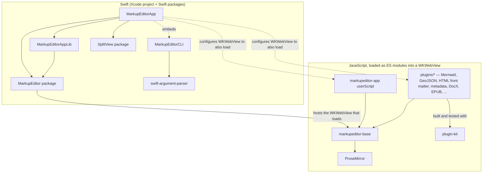

<p align="center">
    
</p>

<p align="center">
    
    
    
    <a href="https://mastodon.social/@stevengharris">
        
    </a>
</p>

# MarkupEditor

A native MacOS Markdown viewer and WYSIWYG editor.

Markdown was designed as a plain text formatting syntax that is as readable as possible while being easily converted to HTML. You still need a tool to render the HTML, often leading to an edit-preview cycle that seems ridiculous when we've had WYSIWYG editors for 40 years. The MarkupEditor presents the HTML as you write, providing immediate feedback while letting you continue to use the Markdown muscle memory you already have. It is customizable and extensible. Built-in extensions let you export to different formats and view/edit diagrams and Markdown front-matter right in your document.

## Features

* Native MacOS app, open source from top to bottom.

* True "what you see is what you get" Markdown editing.

* Shortcuts let you use your Markdown muscle memory naturally.

* Edit and view the WYSIWYG document or the underlying Markdown source.

* GitHub flavored Markdown support, including metadata and HTML in front matter.

* Customizable editing hotkeys.

* Customizable toolbar can be toggled on/off or fully hidden.

* Open from the command line using the `markup <filename>` command.

* Extend MarkupEditor functionality using JavaScript-based *plugins*.

* Export to PDF and DocX out-of-the-box. Add exporters using plugins.

* View Mermaid diagrams and GeoJSON out-of-the-box. Add plugins for additional capabilities.

* Discover hosted plugins and contribute to a community of MarkupEditor users.

## Installation Options

You have three installation options. You also might qualify for a complimentary subscription providing free access to the Unlimited Version.

### Evaluation Version Package

Download the latest [release](https://github.com/stevengharris/MarkupEditorApp/releases) of `MarkupEditor-Eval-<version>.pkg` and run it. This package installs `MarkupEditor.app` in your `Applications` directory along with the `markup` command line utility. The installed app triggers a two-week evaluation time limit from the time you open it. The Evaluation Version makes it easy to try out the MarkupEditor. If you like it and want to avoid the time limitation, you need to either build it yourself from source or subscribe to get access to the Unlimited Version.

### Unlimited Version Package

To support ongoing MarkupEditor app development and to gain access to the pre-built non-time-limited package, go to [https://markupeditor.app](https://markupeditor.app/) and subscribe for $12/year. Once you have subscribed, you will have access to the [downloads page](https://markupeditor.app/downloads) for the Unlimited Version. The Unlimited Version has no license key and does not check if your subscription is valid, so you can use it for as long as it works without renewing your subscription.

### Open Source Build/Install

Developers can clone this repository, open the MarkupEditorApp project in Xcode, and build the `MarkupEditorApp` target. Building the project requires node/npm to be installed.

#### Command Line

The `markup` command line utility is a separate target in Xcode, `MarkupEditorCLI`, producing a standalone tool rather than an app bundle. If you want the command line utility, you might want to build it directly at the command line, from the repository root:

```bash
xcodebuild -scheme MarkupEditorCLI -configuration Release -derivedDataPath ./build build
```

Then put the resulting binary on your PATH by adding a symlink, for example:

```bash
sudo ln -sf "$(pwd)/build/Build/Products/Release/markup" /usr/local/bin/markup
```

Note that both the Evaluation Version and Unlimited Version packages install the command line tool and symlink as part of the installation process, because the command line tool is part of the package.

#### Xcode Schemes

As a developer, probably only the `MarkupEditorApp` and `MarkupEditorCLI` schemes will be of use. `MarkupEditorApp-Unlimited` and `MarkupEditorApp-Eval` build the same `MarkupEditorApp` target under different configurations and are only used as part of the package publishing process.

### Complimentary Subscription

If you fall in any of the following categories, you qualify for a complimentary subscription that provides access to the Unlimited Version:

* You live in a country fighting an aggressive, oligarchic regime threatening its sovereignty. For example: you live in Canada or Ukraine.

* You are a committer on a FOSS project.

* You are a committer on any of the projects the MarkupEditorApp depends on.

* You can't afford the subscription right now.

First, set up an account on <https://markupeditor.app> so I can identify you. Then, send an email to [freepass@markupeditor.app](mailto:freepass@markupeditor.app) with a link and/or very brief intro, and I will set up the complimentary subscription giving you access to the Unlimited Version.

## Command Line Utility

Installation of the Evaluation or Unlimited version package also installs a command line utility. From the command line:

> `markup <filename>`

opens `<filename>` in the MarkupEditor, the same as double-clicking it in Finder. `markup` is installed as a symlink into the app bundle, so removing the app leaves the command pointing at nothing until you reinstall. To remove manually: delete `/usr/local/bin/markup`.

## Plugins

Plugins extend the functionality of the MarkupEditor. The editor comes with pre-installed plugins to support DocX exporting and to let you edit and display Mermaid diagrams and GeoJSON on OpenStreetMap-based maps. You can add and remove plugins from Settings within the app. The catalog of public plugins on the web site is synced with the app. You can create your own plugins and install them locally, and you can contribute a public plugin using a pull request.

Consult the [README.md](https://github.com/stevengharris/MarkupEditorApp/tree/main/plugins) in the plugins directory for information about creating plugins for your own use and contributing them to the community.

## Project Structure Overview

```
MarkupEditorApp/
  UI/
    MarkupEditorApp.swift      - App entry point, MarkupEditor global config
    AppDelegate.swift          - NSMenu construction, menu action notifications
    Top Level/
      MarkupDocumentView.swift - Main view, MarkupDelegate conformance, file I/O, plugin dispatch
      SourceView.swift         - Source view panel
      AppToolbarView.swift     - Main window toolbar
      SourceToolbarView.swift  - Source view toolbar
    Info/                      - Log and document info UI
    Insert Dialogs/            - Native macOS dialogs for inserting links, images, and tables
    Settings/                  - App settings UI including general behavior, toolbar, and keymapping, as well as plugins
    Tour/                      - Onboarding tour
  Helpers/
    MarkupDocument.swift       - Document model (URL, metadata, save/open operations)
    AppConfig.swift            - Codable config loaded from appconfig.json
    SyntaxHighlighter.swift    - Source view syntax highlighting
    Metadata/                  - YAML frontmatter parsing/encoding
  Extensions/                  - Base class extensions
MarkupEditorAppLib/            - Local Swift package dependency used by both MarkupEditorApp and MarkupEditorAppTests.
MarkupEditorCLI/               - `markup` CLI tool target; embedded in the app bundle, shipped via signed .pkg
markupeditor-app/              - JavaScript project loaded as a userScript to support Markdown and more
plugin-kit/                    - Shared JavaScript workspace package every plugin builds and tests with (rollup/vitest config, frontmatter, images, export, register helpers)
plugins/                       - JavaScript plugin projects for codeviews and exporters (Mermaid, GeoJSON, HTML front matter, metadata, DocX, EPUB) + plugins.json for discovery
skills/                        - Claude Code skills to help developers understand and contribute to the app
```

The part of this repository related to the Swift app proper probably has a familiar structure for Swift developers. It is built using SwiftUI in Xcode with very few deviations into AppKit because of SwiftUI deficiencies. The UI and model/utility classes and structs are organized in their own directories as you might expect. The MarkupEditorAppLib is a small Swift Package embedded within the project that enables headless testing of the exporters and plugins without having to place a test dependency on the app itself. In Xcode, it shows up as a local package dependency.

The part that will seem unusual for many Swift developers is the mixture of Swift and JavaScript. This is in large part because the MarkupEditorApp is built on top of the MarkupEditor, a Swift package that wraps calls to an API exposed in the markupeditor-base JavaScript package. The markupeditor-base package in turn depends on ProseMirror to help with the WYSIWYG editing. Here, let's use a Mermaid diagram to show how it fits together. (This diagram displays on GitHub and inside of the MarkupEditor, although it seems the GitHub iOS app only shows the code.)



The plugins to support exporters and codeviews (e.g., Mermaid and GeoJSON) are also written in JavaScript, and these dependencies have to be brought in to the MarkupEditorApp package. The document you are editing when using the app is, ultimately, a `contentEditable` div inside of a WKWebView, and all of the JavaScript is loaded as ES modules into that view.

Life would be simpler if the Swift Package Manager provided a way to express a dependency on a JavaScript package, but this is not the case. Every JavaScript dependency required in the chain produces a `dist` artifact using `npm build` and `rollup`. To ensure that what you build is up-to-date, the Xcode build process uses a script Build Phase to build the JavaScript dependencies and produce the `dist` artifact ES bundles that are loaded into the WKWebView at runtime. Mixing Swift and JavaScript is, admittedly, kind of complicated and drags you across a broad toolchain that you may not be familiar with.

You don't need to know anything about the JavaScript toolchain just to work in the Swift app proper. However, if you want to work in the WYSIWYG editing area, you will have to venture into the Swift MarkupEditor and perhaps into the JavaScript markupeditor-base. If you want to work on a plugin, you will also be exposed to markupeditor-base and even ProseMirror. Fortunately, if you're using AI, this can be made easier.

## About AI

I created the two original libraries that MarkupEditorApp is built-on (the JavaScript [markupeditor-base](https://github.com/stevengharris/markupeditor-base) and Swift [MarkupEditor](https://github.com/stevengharris/MarkupEditor)) without AI-assisted coding. When Xcode introduced a version with AI integration, I used it to help port the existing iOS/Catalyst version of the Swift MarkupEditor to run on MacOS, mainly because I had no real AppKit background and I was curious how the tools performed. With a proper MacOS version up and running, I started this project to focus on WYSIWYG editing of Markdown. I used Claude Code and a tool called [conexus](https://github.com/Hellblazer/nexus) to help in the development process. The code and comments are all reviewed by me, aimed at consumption by humans, not AI. The project's layout and code architecture were designed by me. The project is not "vibe coded", at least in the pejorative sense that I would probably use the term. During development, I used a $20/month Claude Code plan and mostly the Sonnet 5 model.

I have a lot of conflicted feelings about using AI tools, and I won't bore you with them in a README. I will just say that in my experience, the tools can be incredibly useful as a force multiplier for software development. One way they can help is to enable people to work on and contribute to this project without having to understand all of the details under the covers - and there is a *lot* to know about. For example:

* A lot of the heavy lifting associated with WYSIWYG editing is provided using [ProseMirror](https://prosemirror.net). I think ProseMirror is great. Its [documentation](https://prosemirror.net/docs/) is thorough and its [forum](https://discuss.prosemirror.net) is a terrific source of information and support. Still, there are a *lot* of concepts to get your head around when building an editor with ProseMirror.

* ProseMirror capabilities are consumed in [markupeditor-base](https://github.com/stevengharris/markupeditor-base) which in turn exposes its own [API](https://stevengharris.github.io/markupeditor-base/api/index.html) in JavaScript. The markupeditor-base project delivers everything it does using a [web component](https://stevengharris.github.io/markupeditor-base/guide/index.html#markupeditor-as-a-web-component). It comes with a toolbar and can be used directly in JavaScript as a WYSIWYG editing tool. Try it out on the markupeditor-base [web site](https://stevengharris.github.io/markupeditor-base/) and scan the [Developer's Guide](https://stevengharris.github.io/markupeditor-base/guide/index.html).

* The Swift [MarkupEditor](https://github.com/stevengharris/MarkupEditor) library delivers WYSIWYG editing capabilities using a SwiftUI-based MarkupEditorView. Under the covers, that SwiftUI view uses a WKWebView subclass that loads the markupeditor-base web component (which includes the ProseMirror runtime machinery). The Swift MarkupEditor library wraps the JavsScript markupeditor-base API with Swift using `executeJavaScript` from within the WKWebView subclass.

* I don't see a lot of projects combining Swift and JavaScript, and the mechanics of doing so in a build have to be hand crafted. The MarkupEditorApp was designed for extensibility using a plugin mechanism. Plugins are built in JavaScript. They can be quite powerful because they have access to the markupeditor-base API as well as a lot of the ProseMirror API. They can even call back into Swift to make things happen, too.

AI tools are adept at navigating this kind of complexity, especially if they are armed with the right skills.

### AI Skills

If you're using [Claude Code](https://claude.com/product/claude-code), install this repo's skills first. They cover the three-repo architecture and plugin-authoring conventions so you are not starting from scratch:

```bash
npx skills add stevengharris/MarkupEditorApp --skill developing-markupeditorapp
```

Building a plugin? Also install the plugin-specific skills:

```bash
npx skills add stevengharris/MarkupEditorApp --skill writing-markupeditor-plugins
npx skills add stevengharris/MarkupEditorApp --skill writing-codeview-plugins
npx skills add stevengharris/MarkupEditorApp --skill writing-exporter-plugins
```

The `writing-markupeditor-plugins` skill covers the contract shared by every plugin type. The `writing-codeview-plugins` skill is specific to codeview plugins, such as the bundled Mermaid diagram support. Similarly, the writing-exporter-plugins skill covers exporters. After writing these skills, I tested them from a cloned repository by creating a simpler version of the geoJSON codeview plugin and and the EPUB exporter, using Claude Code.

Once installed, just describe what you're trying to do -- Claude Code loads the relevant skill automatically. File an [issue](https://github.com/stevengharris/MarkupEditorApp/issues) if you encounter a markupeditor-base, MarkupEditor, or MarkupEditorApp bug. Send a pull request when you're done.

## Contributions

Contributions, including bug fixes, enhancements, and plugins, are welcome. Clone this repository, run and extend tests as needed, and submit a pull request.

After the discussion above about using AI, it should be easy, eh? Sure, but don't throw an AI-generated pull request at me that only AI has the patience to read. You *know* what I'm talking about. Read and write your pull request yourself, with help from AI if you need. Be prepared to answer questions about it yourself. If I feel like I am interacting with AI on a pull request and not a human, I will just reject it. If I feel like AI contributions are a burden on the project and not a benefit, then I might reconsider the policy.

## Privacy

The MarkupEditor does not require network access to run at any time. You own your documents locally, and the app doesn't track anything about you. You can build it, use it, and extend it yourself.

When you subscribe to get access to the Unlimited Version, you need to identify yourself with an email address. See the [Privacy Policy](https://markupeditor.app/privacy) and [Terms of Use](https://markupeditor.app/terms) on the [web site](https://markupeditor.app).

## License

The MarkupEditorApp is available under the [MIT License](https://github.com/stevengharris/MarkupEditorApp/blob/main/LICENSE).

The source licensing covers the *code*, not the MarkupEditor *name or logo*. "MarkupEditor" and the MarkupEditor logo are trademarks/copyrighted material of Steven G. Harris. You may not use the MarkupEditor name or logo without permission. In short, do not represent the MarkupEditor as your own work or associate the MarkupEditor name or logo with a work derived from it.

## Acknowledgements

The MarkupEditor depends on the amazing [ProseMirror](https://prosemirror.net) as a foundational part of WYSIWYG editing. A portion of the MarkupEditor app subscription revenue, once and if it exceeds expenses to host it, will go to support ProseMirror. If you find the MarkupEditor to be useful and/or are not using the supported version, please [support ProseMirror directly.](https://marijnhaverbeke.nl/fund/)
